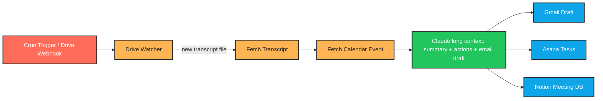

# CLAUDE.md — Meeting Notes & Action Items Agent

> **Language:** Python (3.10+)
> **Client:** James O., CEO — Meridian Consulting Group
> **Budget:** $1,500–3,000 | **Timeline:** 1–2 weeks

---

## 1. Project Overview

Meridian's consultants run 8–12 client meetings per week and currently spend 30–45 minutes after each one writing up notes, extracting actions, and sending follow-up emails. We are building an agent that **automatically picks up Google Meet transcripts from Google Drive**, processes them with Claude, and produces:

- A clean meeting summary
- Action items (with owner + deadline + supporting quote)
- A drafted follow-up email
- Asana tasks
- A Notion meeting database entry

**Everything is a draft — nothing auto-sends.** Humans review and approve every output before it goes anywhere external.

---

## 2. Required Features

| # | Feature | Notes |
|---|---------|-------|
| 1 | Auto-detect new Google Meet transcripts in Drive | Poll every 5 minutes or use Drive change webhooks |
| 2 | Extract summary, decisions, action items | Action items must have owner + deadline |
| 3 | Draft follow-up email to all attendees | Saved as Gmail draft — never sent |
| 4 | Create Asana tasks with assignees and due dates | One task per action item |
| 5 | Save structured notes to Notion meeting database | Schema-validated entries |
| 6 | All outputs go to drafts/review | Nothing auto-sends or auto-posts |

---

## 3. Important Constraints

- **Confidentiality:** Client names and meeting content are confidential. **No third-party logging.** No content sent to any LLM provider other than Anthropic. No analytics tools that ingest message bodies.
- **Long transcripts:** Must handle 1-hour transcripts (~10–15k tokens) **without truncating**. Use Claude's long context window.
- **Evidence required:** Every action item must include the **exact quote** from the transcript as supporting evidence.
- **Stack lock-in:** Works within existing Google Workspace — no new tools for the consultants.

---

## 4. Tech Stack

```
Python 3.10+         |   Google Drive API     |   Google Calendar API
Gmail API            |   Asana API            |   Notion API
Claude (long ctx)    |   APScheduler          |   Pydantic (validation)
```

---

## 5. Architecture

```
   ┌──────────────────┐
   │  Google Meet     │
   │  (records call,  │
   │   auto-saves     │
   │   transcript to  │
   │   Drive)         │
   └──────────────────┘
            │
            ▼
   ┌─────────────────────────────┐
   │ Google Drive Watcher        │
   │ - Polls /Meet Recordings/   │
   │ - Detects new transcript    │
   │ - Pulls .txt or .docx       │
   └─────────────────────────────┘
            │
            ▼
   ┌─────────────────────────────┐
   │ Meeting Context Enricher    │
   │ - Looks up Calendar event   │
   │   matching the transcript   │
   │ - Pulls attendees, title,   │
   │   description               │
   └─────────────────────────────┘
            │
            ▼
   ┌─────────────────────────────────────────────┐
   │            Claude (long context)            │
   │  Prompt:                                    │
   │    - Summarize the meeting                  │
   │    - List decisions made                    │
   │    - Extract action items with:             │
   │         owner, deadline, supporting quote   │
   │    - Draft follow-up email                  │
   │  Output: structured JSON                    │
   └─────────────────────────────────────────────┘
            │
            ▼
   ┌─────────────────────────────────────────────┐
   │           Output Distributor                │
   │ ┌─────────────┬───────────────┬───────────┐ │
   │ │ Gmail Draft │ Asana Tasks   │ Notion DB │ │
   │ │ (not sent)  │ (assigned)    │ (logged)  │ │
   │ └─────────────┴───────────────┴───────────┘ │
   └─────────────────────────────────────────────┘
```

---

## 6. Development Workflow

```
┌──────────────────────────────────────────────────────────────┐
│                  DEVELOPMENT WORKFLOW                        │
└──────────────────────────────────────────────────────────────┘

  STEP 1 — PLAN
    • Read this CLAUDE.md fully before writing code
    • Pick ONE integration to build first (suggest: Drive watcher)
    • Stub out the rest of the pipeline with mock data

  STEP 2 — IMPLEMENT (Python)
    • All secrets via environment variables (.env + dotenv)
    • Use Pydantic models for the structured Claude output —
      do NOT trust raw JSON parsing
    • Log every API call (request URL, status, duration)
    • Wrap every API call in try/except with specific exceptions

  STEP 3 — RUN THE SCRIPT
    • Test with a sample transcript (use a fake meeting)
    • Verify each downstream output (Gmail/Asana/Notion) is a
      DRAFT — confirm by checking the UI manually

  STEP 4 — IF YOU HIT AN ERROR ────────────────────────────────
    │
    │  4a. READ THE FULL ERROR MESSAGE AND TRACEBACK
    │      ─ Do NOT skip lines
    │      ─ Read every line of the traceback, top to bottom
    │      ─ Identify:
    │           • Exact file and line number
    │           • Exception type
    │           • The actual value that caused the failure
    │      ─ For Google APIs: print the full HttpError content;
    │        the JSON body explains the real issue (scope,
    │        permission, quota)
    │      ─ For Claude JSON parse errors: log the raw text
    │        response BEFORE attempting json.loads
    │
    │  4b. FIX THE SCRIPT
    │      ─ Find the root cause — do NOT guess
    │      ─ Re-read the function being edited end to end
    │      ─ Make the smallest possible targeted fix
    │      ─ If the bug came from a malformed Claude response,
    │        ALSO improve the prompt to prevent recurrence
    │
    │  4c. RETEST
    │      ─ Re-run the full pipeline, not just the failing step
    │      ─ Confirm the original error is gone
    │      ─ Run two edge cases:
    │           • Very short transcript (< 1 minute)
    │           • 1-hour transcript (test long context)
    │      ─ Verify nothing was sent to a real client by accident
    │
    │  4d. DOCUMENT WHAT YOU LEARNED
    │      ─ Append an entry to the "## Error Log" section below
    │      ─ Use the template provided
    │      ─ One sentence "Lesson learned" — make it concrete
    │
    └─────────────────────────────────────────────────────────

  STEP 5 — VALIDATE OUTPUT
    • Every action item has owner + deadline + verbatim quote
    • Gmail message is a DRAFT (check the Drafts folder)
    • Asana tasks have correct assignees from the attendee list
    • Notion entry validates against the schema

  STEP 6 — GENERATE README.md
    • See section "## 8. README.md Requirements" below
```

---

## 7. Error Log

> Every bug encountered MUST be logged here. This is non-negotiable.

### Entry Template

```
### [YYYY-MM-DD] — [short title]

**Error Type:** e.g. `googleapiclient.errors.HttpError 403`

**Full Error Message:**
\```
Paste the LAST 5–10 lines of the traceback verbatim.
For Google API errors, include the full JSON error body.
For Claude parsing errors, include the raw response text.
\```

**What I Was Doing:**
The action being performed when the error fired (e.g. "creating
Asana task for action item #3 with assignee email
sarah@meridian.com").

**Root Cause:**
The actual underlying cause. Not the symptom.

**Fix Applied:**
The exact code change. Reference the function and file.
If the fix involved a prompt change, paste the new prompt fragment.

**Lesson Learned:**
One concrete sentence.
```

---

## 8. README.md Requirements

After the project is functional, generate a `README.md` file in the project root. The README must include an **n8n-style workflow / architecture graphic** so the consultants (non-engineers) can understand the flow.

### Required README sections

1. **Project title + 1-line tagline**
2. **What it does** (3–5 sentences, non-technical)
3. **Workflow diagram** — render as an **n8n-style node graph** using Mermaid `flowchart LR`. Each step in the pipeline is a discrete node tile, like in n8n. Color-code by node type: trigger, fetch, AI, output.
4. **Tech stack table**
5. **Folder structure**
6. **Setup instructions** — clone, venv, install, OAuth setup for Google, env vars
7. **Environment variables** — table of every var
8. **Running locally** — single command to run the pipeline against a sample transcript
9. **Scheduling** — how to run on a cron / APScheduler
10. **Safety guarantees** — explicit statement that no outputs auto-send
11. **Troubleshooting** — common errors and fixes (sourced from the Error Log)

### Mermaid template for the workflow graphic



> **Important:** The README should render correctly on GitHub (which supports Mermaid natively). Preview before final commit.

---

## 9. Python Project Conventions

- **Folder structure:**
  ```
  /src
    /drive          # Drive watcher + file fetch
    /calendar       # Calendar event lookup
    /llm            # Claude wrapper + prompt + Pydantic schema
    /outputs
      gmail.py
      asana.py
      notion.py
    /scheduler      # APScheduler entrypoint
  /tests
    /fixtures       # sample transcripts (anonymized)
  .env.example
  requirements.txt
  README.md
  CLAUDE.md
  ```
- **Pydantic schema** for Claude's output — validates EVERY action item has owner, deadline, supporting_quote.
- **Logging:** `logging` module, structured JSON logs, never log full transcript bodies (PII).
- **Idempotency:** Use a `processed_transcripts.json` file (or sqlite) to ensure the same transcript is never processed twice.
- **Type hints:** Required.
- **Tests:** `pytest` with mocked Google/Asana/Notion clients.
