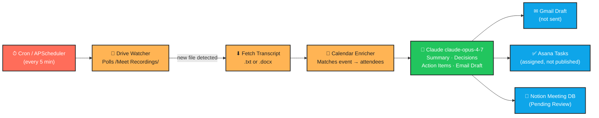

# Meeting Notes & Action Items Agent

> Automatically transforms Google Meet transcripts into structured summaries, action items, Gmail drafts, Asana tasks, and Notion entries — all in draft form, waiting for your review.

---

## What It Does

After every client meeting, consultants no longer need to spend 30–45 minutes writing up notes. The agent monitors your Google Drive for new Meet recordings, reads the transcript with Claude's long-context AI, and within minutes produces a clean summary, a list of decisions, and fully attributed action items — each one backed by a verbatim quote from the transcript so you can verify every commitment.

Every output goes into a draft state: Gmail saves an unsent email to your Drafts folder, Asana tasks are created but can be reviewed before assigning, and the Notion entry is created with a "Pending Review" status. **Nothing is ever sent or published automatically.** A human approves every output.

The system is designed for professional consulting work where client confidentiality is critical. Transcript content is never logged, and no data is sent to any service other than Anthropic's Claude API.

---

## Workflow Diagram



---

## Tech Stack

| Component | Technology |
|---|---|
| AI / NLP | Claude `claude-opus-4-7` (Anthropic) |
| Transcript source | Google Drive API v3 |
| Meeting context | Google Calendar API v3 |
| Follow-up email | Gmail API v1 (drafts only) |
| Task management | Asana REST API v1 |
| Meeting database | Notion API + `notion-client` |
| Scheduling | APScheduler 3.x (blocking) |
| Schema validation | Pydantic v2 |
| Language | Python 3.10+ |

---

## Folder Structure

```
meeting-notes-agent/
├── src/
│   ├── drive/
│   │   ├── watcher.py          # Polls Drive for new transcripts
│   │   └── fetcher.py          # Downloads .txt / .docx files
│   ├── gcal/
│   │   └── enricher.py         # Matches transcript to Calendar event
│   │                           # (named gcal/ to avoid shadowing stdlib `calendar`)
│   ├── llm/
│   │   ├── schema.py           # Pydantic models for Claude output
│   │   ├── prompt.py           # System prompt + tool definition
│   │   └── claude_client.py    # Claude API wrapper
│   ├── outputs/
│   │   ├── gmail.py            # Creates Gmail draft
│   │   ├── asana.py            # Creates Asana tasks
│   │   └── notion.py           # Logs entry to Notion database
│   ├── scheduler/
│   │   └── main.py             # APScheduler entrypoint
│   ├── auth.py                 # Google OAuth2 (Drive + Calendar + Gmail)
│   ├── idempotency.py          # Prevents reprocessing same transcript
│   ├── logging_config.py       # Structured JSON logging
│   ├── resilience.py           # Retry decorator + circuit breaker
│   ├── dead_letter.py          # DLQ for failed transcripts (auto-retry)
│   ├── health.py               # Pre-flight health check suite
│   └── pipeline.py             # Main orchestrator
├── tests/
│   ├── fixtures/
│   │   └── sample_transcript.txt
│   ├── conftest.py
│   ├── test_schema.py
│   ├── test_pipeline.py
│   ├── test_resilience.py
│   ├── test_dead_letter.py
│   └── test_health.py
├── .github/workflows/test.yml  # CI: pytest + ruff on every push/PR
├── Dockerfile                  # Container image
├── docker-compose.yml          # One-command deploy with persistent state
├── .dockerignore
├── .env.example
├── pyproject.toml              # PEP 621 metadata + ruff/pyright config
├── requirements.txt            # Pinned runtime deps (mirrors pyproject)
├── CLAUDE.md
└── README.md
```

---

## Setup Instructions

### 1. Clone and create a virtual environment

```bash
git clone <your-repo-url>
cd meeting-notes-agent
python -m venv .venv

# macOS / Linux
source .venv/bin/activate

# Windows
.venv\Scripts\activate
```

### 2. Install dependencies

```bash
pip install -r requirements.txt
```

### 3. Configure Google OAuth2

1. Go to [Google Cloud Console](https://console.cloud.google.com/)
2. Create a new project (or use an existing one)
3. Enable these APIs: **Google Drive API**, **Google Calendar API**, **Gmail API**
4. Go to **APIs & Services → Credentials → Create Credentials → OAuth 2.0 Client ID**
5. Choose **Desktop App**, download the JSON, and save it as `credentials.json` in the project root
6. On first run, a browser window will open for consent — approve all requested scopes
7. The token is saved to `token.json` automatically for future runs

### 4. Set up Asana

1. Go to [Asana Developer Console](https://app.asana.com/0/developer-console)
2. Create a **Personal Access Token**
3. Note your **Workspace GID** (visible in the URL when you open your workspace)
4. Optionally note a **Project GID** where tasks should be created

### 5. Set up Notion

1. Go to [Notion Integrations](https://www.notion.so/my-integrations) and create a new integration
2. Copy the **Internal Integration Token**
3. Open your Meetings database in Notion, click **Share**, and invite the integration
4. Copy the **Database ID** from the database URL:
   `https://www.notion.so/{workspace}/{DATABASE_ID}?v=...`

The database should have these properties:

| Property | Type |
|---|---|
| Title | Title |
| Date | Date |
| Summary | Text |
| Decisions | Text |
| Action Items | Text |
| Status | Select (with option: "Pending Review") |

### 6. Configure environment variables

```bash
cp .env.example .env
# Edit .env with your actual credentials
```

---

## Environment Variables

| Variable | Description | Required |
|---|---|---|
| `ANTHROPIC_API_KEY` | Anthropic API key | Yes |
| `GOOGLE_CREDENTIALS_PATH` | Path to OAuth2 credentials JSON | Yes |
| `GOOGLE_TOKEN_PATH` | Path to save/load the OAuth token | Yes |
| `DRIVE_TRANSCRIPTS_FOLDER` | Drive folder name for Meet recordings | Yes |
| `ASANA_ACCESS_TOKEN` | Asana personal access token | Yes |
| `ASANA_WORKSPACE_GID` | Asana workspace GID | Yes |
| `ASANA_PROJECT_GID` | Asana project GID for new tasks | No |
| `NOTION_TOKEN` | Notion internal integration token | Yes |
| `NOTION_DATABASE_ID` | Notion meetings database ID | Yes |
| `POLL_INTERVAL_MINUTES` | Drive poll frequency (default: 5) | No |
| `PROCESSED_TRANSCRIPTS_PATH` | Idempotency file path | No |
| `LOG_LEVEL` | Log level: DEBUG/INFO/WARNING/ERROR | No |

---

## Running Locally

### Single pipeline run (no scheduler)

```python
from dotenv import load_dotenv
load_dotenv()

from src.logging_config import configure_logging
from src.pipeline import MeetingPipeline

configure_logging()
pipeline = MeetingPipeline()
results = pipeline.run_once()
print(f"Processed {len(results)} transcript(s)")
```

### Continuous scheduled run

```bash
python -m src.scheduler.main
```

The scheduler starts immediately, runs the pipeline, then repeats every `POLL_INTERVAL_MINUTES` minutes. Press `Ctrl+C` to stop cleanly.

### Run against the sample transcript (offline test)

```python
from dotenv import load_dotenv
load_dotenv()

from src.llm.claude_client import ClaudeClient
from pathlib import Path

client = ClaudeClient()
transcript = Path("tests/fixtures/sample_transcript.txt").read_text()
analysis = client.analyse_transcript(
    transcript=transcript,
    meeting_title="Q2 Marketing Strategy Review",
)
print(analysis.model_dump_json(indent=2))
```

---

## Running Tests

```bash
pytest tests/ -v
```

All tests use mocked Google, Asana, and Notion clients — no real API calls are made during the test suite.

---

## Scheduling on a Server

The built-in APScheduler runs in-process. For production deployment:

**Option A — Run as a systemd service (Linux)**

```ini
[Unit]
Description=Meeting Notes Agent
After=network.target

[Service]
WorkingDirectory=/path/to/meeting-notes-agent
ExecStart=/path/to/.venv/bin/python -m src.scheduler.main
Restart=on-failure
EnvironmentFile=/path/to/.env

[Install]
WantedBy=multi-user.target
```

**Option B — Docker**

```dockerfile
FROM python:3.11-slim
WORKDIR /app
COPY requirements.txt .
RUN pip install --no-cache-dir -r requirements.txt
COPY . .
CMD ["python", "-m", "src.scheduler.main"]
```

---

## Safety Guarantees

| Output | How it's kept in draft |
|---|---|
| Follow-up email | Saved to Gmail **Drafts** folder via `drafts.create` — the send endpoint is never called |
| Asana tasks | Created with `completed: false` — no auto-assignment without human review |
| Notion entry | Created with **Status: Pending Review** — consultants filter on this status |

The pipeline will never call `messages.send`, never mark an Asana task complete, and never change the Notion status to anything other than "Pending Review". These guarantees are enforced in code, not just by configuration.

---

## Deploying with Docker

A one-command production deployment that survives container restarts:

```bash
# 1. Create a state directory and put your Google credentials in it.
mkdir -p state
cp credentials.json state/

# 2. Make sure .env is configured (see "Environment Variables" above).
cp .env.example .env  # then edit it

# 3. Build and start.
docker compose up -d --build

# 4. Tail logs.
docker compose logs -f meeting-agent
```

The `state/` directory is mounted as a volume, so the OAuth token, the
idempotency tracker, and the dead letter queue all persist across restarts
and image rebuilds. On first run, OAuth consent must be completed once on
the host (run `python -m src.scheduler.main` locally) — afterwards the
generated `state/token.json` is reused inside the container.

To stop:

```bash
docker compose down
```

To rebuild after code changes:

```bash
docker compose up -d --build
```

---

## Self-Annealing & Reliability

The pipeline is designed to recover from common deployment-time failures
without manual intervention:

| Failure | Recovery mechanism |
|---|---|
| Transient API blip (network, rate limit) | `@retry` with exponential backoff + jitter on Claude, Gmail, Notion, Asana, Drive, Calendar |
| Service repeatedly down | Per-service `CircuitBreaker` opens after 3 failures, probes recovery after 5 min |
| Transcript fetch / Claude failure | `DeadLetterQueue` retries automatically (1h → 2h → 4h → 8h → 24h) |
| All outputs unreachable | Transcript is re-queued, **not** marked processed — retried next cycle |
| Critical service down at startup | `HealthChecker` skips the cycle entirely rather than producing partial output |
| Notion DB schema drift | Health check verifies all six required properties exist & have the right type |
| Asana N+1 lookups | Per-instance email→GID cache |
| 6 retries exhausted | Marked permanently failed, logged as ERROR for human review |

---

## Troubleshooting

### `FileNotFoundError: Google credentials file not found`

Download `credentials.json` from Google Cloud Console (see Setup step 3). Make sure the path in `.env` matches the actual file location.

### `HttpError 403` from Google APIs

Your OAuth consent may be missing a required scope. Delete `token.json` and re-run — you will be prompted to re-authorise with the full scope list. Also verify the API (Drive / Calendar / Gmail) is enabled in Google Cloud Console.

### `EnvironmentError: ANTHROPIC_API_KEY environment variable is not set`

Copy `.env.example` to `.env` and fill in your Anthropic API key. Make sure you run `load_dotenv()` before initialising any clients, or use the scheduler entrypoint which does this automatically.

### `ValueError: Claude output failed schema validation`

The model returned a response that didn't match the expected schema. This is rare with forced tool use (`tool_choice`). Check `LOG_LEVEL=DEBUG` output for the raw response. If it recurs, the prompt in `src/llm/prompt.py` can be adjusted.

### Notion `APIResponseError: Could not find database`

Make sure the integration has been invited to the database (Share → invite integration). The `NOTION_DATABASE_ID` must be the bare ID, not the full URL.

### Asana tasks created without an assignee

The agent looks up the assignee by email via the Asana typeahead API. If the email in the transcript doesn't match an Asana workspace member, the task is created unassigned. Assign manually after reviewing the task.

---

## Error Log

> Errors encountered during development are logged here per the CLAUDE.md specification.

*(No errors logged yet — this section will be updated as the project is tested.)*
